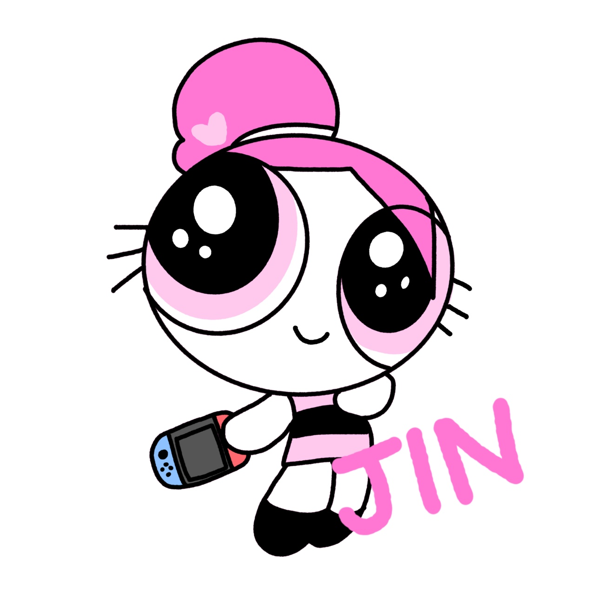

<div align='center'></div>

# <div align='center'>🐶재미있는 펫들의 스토리😺</div>


<br>

### 🔗 Geppetto 관련 링크

<b>배포 주소 : [제페토 링크](https://geppetto88.netlify.app)</b>

<b>피그마(Figma) : [피그마 링크](https://www.figma.com/file/6LVAIHgrLqpvnylzzWf25r/Geppetto?type=design&node-id=0-1&mode=design&t=VIzvIJAYwMzZrdQb-0) </b>

<b>발표자료 : [ppt 링크](https://www.canva.com/design/DAFvPkI_0ZI/Iar9FlTeitC929kV7t8pog/view?utm_content=DAFvPkI_0ZI&utm_campaign=designshare&utm_medium=link&utm_source=publishsharelink)</b>

<br>


### ⚙️기술 스택

<div>


  
  
  
  
  
  
  
  
  
</div>

<br>
<br>
<br>

### 👩‍👩‍👧‍👦 팀원 소개

|                                                 **백수빈**                                                 |                                                  **윤진**                                                   |                                                **김재희**                                                 |                                                  **이재호**                                                  |
| :--------------------------------------------------------------------------------------------------------: | :---------------------------------------------------------------------------------------------------------: | :-------------------------------------------------------------------------------------------------------: | :----------------------------------------------------------------------------------------------------------: |
| [ <br/> BBIIN](https://github.com/BBIIN) | [ <br/> jin62413](https://github.com/jin62413) | [ <br/> jay0425](https://github.com/jay0425) | [ <br/> ewsn0825](https://github.com/ewsn0825) |

</div>

<br>
<br>
<br>

### 📅 개발 기간

<b> 09-02 ~ 09-09 : 기획 및 피그마 디자인, 스캐폴딩</b>

<b>09-10 ~ 09-21 : 기능 구현</b>

<b>09-22 ~ 09-24 : 코드 리팩토링</b>

<br>
<br>


### 🎯 프로젝트 목표

 - <b>반려동물을 키우는 사람들이 편하게 이야기 할 수 있고, 필요한 정보도 얻어갈 수 있는 커뮤니티 만들기</b>

<br>
<br>

### 🏆 개인 별 목표

|이름|목표|
|:------:|----------------------------------------------------------|
|<b>백수빈</b>|<b>1. CRUD 사용해보기<br>2. 굴러가는 프로젝트 만들기</b>|
|<b>윤진</b>|<b>1. 피그마 사용해보기 <br>2. CRUD 경험해보기</b>|
|<b>김재희</b>|<b>1. CRUD 해보기</b>|
|<b>이재호</b>|<b>1. 데이터 CRUD 다뤄보기 <br>2. 리액트 상태관리 이해해보기</b>|

<br>
<br>


### 🌲 파일 트리 구조

```
📦src
 ┣ 📂api
 ┃ ┗ 📜pocketbase.js
 ┣ 📂assets
 ┃ ┣ 📂banner
 ┃ ┃ ┣ 📜banner2@1120w.png
 ┃ ┃ ┣ 📜banner2@1420w.png
 ┃ ┃ ┣ 📜banner2@1720w.png
 ┃ ┃ ┣ 📜banner2@1920w.png
 ┃ ┃ ┣ 📜banner@1120w.png
 ┃ ┃ ┣ 📜banner@1420w.png
 ┃ ┃ ┣ 📜banner@1720w.png
 ┃ ┃ ┗ 📜banner@1920w.png
 ┃ ┣ 📂base_images
 ┃ ┃ ┣ 📜avatar0.png
 ┃ ┃ ┣ 📜avatar0.svg
 ┃ ┃ ┣ 📜avatar1.png
 ┃ ┃ ┣ 📜avatar1.svg
 ┃ ┃ ┣ 📜avatar2.png
 ┃ ┃ ┣ 📜avatar2.svg
 ┃ ┃ ┣ 📜avatar3.png
 ┃ ┃ ┣ 📜avatar3.svg
 ┃ ┃ ┣ 📜avatar4.png
 ┃ ┃ ┣ 📜avatar4.svg
 ┃ ┃ ┣ 📜avatar5.png
 ┃ ┃ ┣ 📜avatar5.svg
 ┃ ┃ ┣ 📜avatar6.png
 ┃ ┃ ┣ 📜avatar6.svg
 ┃ ┃ ┣ 📜avatar7.png
 ┃ ┃ ┣ 📜avatar7.svg
 ┃ ┃ ┣ 📜avatar8.png
 ┃ ┃ ┣ 📜avatar8.svg
 ┃ ┃ ┣ 📜avatar9.png
 ┃ ┃ ┗ 📜avatar9.svg
 ┃ ┣ 📂community
 ┃ ┃ ┣ 📜bookmark.svg
 ┃ ┃ ┣ 📜bookmarkOn.svg
 ┃ ┃ ┣ 📜cake.svg
 ┃ ┃ ┣ 📜commentProfile.svg
 ┃ ┃ ┣ 📜heart.svg
 ┃ ┃ ┣ 📜heartOn.svg
 ┃ ┃ ┣ 📜mung.svg
 ┃ ┃ ┣ 📜nonProfile.svg
 ┃ ┃ ┣ 📜radio.svg
 ┃ ┃ ┣ 📜radioChecked.svg
 ┃ ┃ ┣ 📜share.svg
 ┃ ┃ ┗ 📜yawn.svg
 ┃ ┣ 📂fonts
 ┃ ┣ 📂icon
 ┃ ┃ ┣ 📜arrow.svg
 ┃ ┃ ┣ 📜arrow_back.svg
 ┃ ┃ ┣ 📜arrow_forward.svg
 ┃ ┃ ┣ 📜bookmark.svg
 ┃ ┃ ┣ 📜bookmark_check.svg
 ┃ ┃ ┣ 📜checkFalse.svg
 ┃ ┃ ┣ 📜checkTrue.svg
 ┃ ┃ ┣ 📜close.svg
 ┃ ┃ ┣ 📜closeModal.svg
 ┃ ┃ ┣ 📜comment.svg
 ┃ ┃ ┣ 📜facebook.svg
 ┃ ┃ ┣ 📜github.svg
 ┃ ┃ ┣ 📜google.svg
 ┃ ┃ ┣ 📜instagram.svg
 ┃ ┃ ┣ 📜kakao.svg
 ┃ ┃ ┣ 📜like.svg
 ┃ ┃ ┣ 📜like_check.svg
 ┃ ┃ ┣ 📜link.svg
 ┃ ┃ ┣ 📜logo.svg
 ┃ ┃ ┣ 📜mainbanner-left.svg
 ┃ ┃ ┣ 📜mainbanner-right.svg
 ┃ ┃ ┣ 📜more.svg
 ┃ ┃ ┣ 📜photo.svg
 ┃ ┃ ┣ 📜search.svg
 ┃ ┃ ┗ 📜share.svg
 ┃ ┣ 📂images
 ┃ ┃ ┣ 📜baseProfile_0.svg
 ┃ ┃ ┣ 📜dog.jpg
 ┃ ┃ ┗ 📜Ellipse.svg
 ┃ ┣ 📂profile
 ┃ ┃ ┣ 📜buri.jpg
 ┃ ┃ ┣ 📜gom.png
 ┃ ┃ ┣ 📜jin.jpg
 ┃ ┃ ┗ 📜pikachu.webp
 ┃ ┗ 📂recommend
 ┃ ┃ ┣ 📜eventBanner.svg
 ┃ ┃ ┣ 📜pet1.svg
 ┃ ┃ ┣ 📜pet2.svg
 ┃ ┃ ┗ 📜pet3.svg
 ┣ 📂components
 ┃ ┣ 📂button
 ┃ ┃ ┣ 📂share
 ┃ ┃ ┃ ┣ 📜KakaoShareButton.jsx
 ┃ ┃ ┃ ┗ 📜UrlShareButton.jsx
 ┃ ┃ ┣ 📜Bookmark.jsx
 ┃ ┃ ┣ 📜CommentCount.jsx
 ┃ ┃ ┣ 📜EditDelete.jsx
 ┃ ┃ ┣ 📜likeButton.jsx
 ┃ ┃ ┗ 📜ShareButton.jsx
 ┃ ┣ 📂commentInput
 ┃ ┃ ┣ 📜Comment.jsx
 ┃ ┃ ┗ 📜CommentEditDelete.jsx
 ┃ ┣ 📂Community
 ┃ ┃ ┣ 📜CommunityComment.jsx
 ┃ ┃ ┣ 📜CommunityEdit.jsx
 ┃ ┃ ┣ 📜CommunityList.jsx
 ┃ ┃ ┣ 📜CommunityListContent.jsx
 ┃ ┃ ┣ 📜CommunityListPost.jsx
 ┃ ┃ ┣ 📜CommunityMain.jsx
 ┃ ┃ ┗ 📜CommunityNew.jsx
 ┃ ┣ 📂contents
 ┃ ┃ ┣ 📂comment
 ┃ ┃ ┃ ┣ 📜CommentEdit.jsx
 ┃ ┃ ┃ ┣ 📜ContentComment.jsx
 ┃ ┃ ┃ ┗ 📜ContentCommentForm.jsx
 ┃ ┃ ┣ 📜ContentDetail.jsx
 ┃ ┃ ┣ 📜ContentPost.jsx
 ┃ ┃ ┗ 📜Item.jsx
 ┃ ┣ 📂event
 ┃ ┃ ┣ 📜EventBanner.jsx
 ┃ ┃ ┗ 📜EventBannerImage.jsx
 ┃ ┣ 📂footer
 ┃ ┃ ┗ 📜RelatedSite.jsx
 ┃ ┣ 📂header
 ┃ ┃ ┗ 📜Logo.jsx
 ┃ ┣ 📂home
 ┃ ┃ ┣ 📜MainBanner.jsx
 ┃ ┃ ┣ 📜Pagination.jsx
 ┃ ┃ ┣ 📜PopularItem.jsx
 ┃ ┃ ┣ 📜Posts.jsx
 ┃ ┃ ┣ 📜SmallButton.jsx
 ┃ ┃ ┣ 📜Spinner.jsx
 ┃ ┃ ┗ 📜SwiperMainBanner.jsx
 ┃ ┣ 📂MainRecommend
 ┃ ┃ ┣ 📜BannerRecommend.jsx
 ┃ ┃ ┣ 📜Recommend.jsx
 ┃ ┃ ┣ 📜RecommendItem.jsx
 ┃ ┃ ┗ 📜SwiperRecommend.jsx
 ┃ ┣ 📂searchList
 ┃ ┃ ┣ 📜SearchCommunityList.jsx
 ┃ ┃ ┣ 📜SearchCommunityListContent.jsx
 ┃ ┃ ┣ 📜SearchCommunityListPost.jsx
 ┃ ┃ ┣ 📜SearchContentPost.jsx
 ┃ ┃ ┗ 📜SearchItem.jsx
 ┃ ┣ 📂signIn
 ┃ ┃ ┗ 📜LoginButtonGroup.jsx
 ┃ ┗ 📂signUp
 ┃ ┃ ┣ 📂Agreement
 ┃ ┃ ┃ ┣ 📜MarketingAgreement.jsx
 ┃ ┃ ┃ ┣ 📜PrivacyPolicy.jsx
 ┃ ┃ ┃ ┗ 📜ServiceAgreement.jsx
 ┃ ┃ ┣ 📜AgreementCheckbox.jsx
 ┃ ┃ ┣ 📜Backdrop.jsx
 ┃ ┃ ┣ 📜BirthDate.jsx
 ┃ ┃ ┣ 📜Dialog.jsx
 ┃ ┃ ┣ 📜FormInput.jsx
 ┃ ┃ ┣ 📜ImageUploader.jsx
 ┃ ┃ ┣ 📜Modal.jsx
 ┃ ┃ ┗ 📜SearchForm.jsx
 ┣ 📂contexts
 ┃ ┗ 📜Auth.jsx
 ┣ 📂hooks
 ┃ ┣ 📜useDocumentTitle.js
 ┃ ┣ 📜useFetchData.js
 ┃ ┣ 📜useStorage.js
 ┃ ┣ 📜useStorage.old.js
 ┃ ┗ 📜useSwiperRef.js
 ┣ 📂layout
 ┃ ┣ 📜Footer.jsx
 ┃ ┣ 📜Header.jsx
 ┃ ┣ 📜HeaderNav.jsx
 ┃ ┣ 📜MainBox.jsx
 ┃ ┗ 📜RootLayout.jsx
 ┣ 📂pages
 ┃ ┣ 📜Community.jsx
 ┃ ┣ 📜Contents.jsx
 ┃ ┣ 📜Event.jsx
 ┃ ┣ 📜Home.jsx
 ┃ ┣ 📜Place.jsx
 ┃ ┣ 📜SearchList.jsx
 ┃ ┣ 📜SignIn.jsx
 ┃ ┗ 📜SignUP.jsx
 ┣ 📂pocketbase
 ┃ ┣ 📂pb_data
 ┃ ┃ ┣ 📜data.db
 ┃ ┃ ┣ 📜logs.db
 ┃ ┃ ┗ 📜types.d.ts
 ┃ ┣ 📜CHANGELOG.md
 ┃ ┣ 📜LICENSE.md
 ┃ ┗ 📜pocketbase.exe
 ┣ 📂store
 ┃ ┣ 📜agreementStore.js
 ┃ ┣ 📜auth.js
 ┃ ┣ 📜dateStore.js
 ┃ ┣ 📜imageUploadStore.js
 ┃ ┣ 📜imageURL.js
 ┃ ┣ 📜login.js
 ┃ ┣ 📜registerStore.js
 ┃ ┗ 📜searchStore.js
 ┣ 📂styles
 ┃ ┣ 📜custom-reset.css
 ┃ ┣ 📜font.css
 ┃ ┣ 📜pretendard.css
 ┃ ┗ 📜tailwind.css
 ┣ 📂utils
 ┃ ┣ 📜dashDate.js
 ┃ ┣ 📜debounce.js
 ┃ ┣ 📜getPbImageURL.js
 ┃ ┣ 📜index.js
 ┃ ┣ 📜kakaoLogout.js
 ┃ ┣ 📜randomNumber.js
 ┃ ┗ 📜setFiles.js
 ┣ 📜App.jsx
 ┣ 📜main.jsx
 ┗ 📜routes.jsx
```

<br>
<br>


### 📌 주요 페이지 및 기능

<br>

#### 메인 페이지


<div align='center'>

  

  <br>

  <b>메인 페이지 - 스와이퍼</b>
  
</div>

<br><br>

<div align='center'>

  

  <br>

  <b>메인 페이지 - 추천 콘텐츠</b>
  
</div>

<br><br>

<div align='center'>

  

  <br>

  <b>메인 페이지 - 커뮤니티 인기글</b>
  
</div>

<br><br>

#### 콘텐츠

<div align='center'>

  

  <br>

  <b>콘텐츠 - 댓글작성</b>
  
</div>

<br><br>

<div align='center'>

  

  <br>

  <b>콘텐츠 - 댓글 수정 및 삭제</b>
  
</div>

<br><br>

<div align='center'>

  

  <br>

  <b>콘텐츠 - 좋아요 기능</b>
  
</div>

<br><br>

<div align='center'>

  

  <br>

  <b>콘텐츠 - 공유 기능</b>
  
</div>

<br><br>

#### 커뮤니티

<div align='center'>

  

  <br>

  <b>커뮤니티 - 최신순 & 인기 순 정렬</b>
  
</div>

<br><br>

<div align='center'>

  

  <br>

  <b>커뮤니티 - 글쓰기</b>
  
</div>

<br><br>

<div align='center'>

  

  <br>

  <b>커뮤니티 - 글수정</b>
  
</div>

<br><br>

<div align='center'>

  

  <br>

  <b>커뮤니티 - 글삭제</b>
  
</div>

<br><br>

<div align='center'>

  

  <br>

  <b>커뮤니티 - 댓글작성</b>
  
</div>

<br><br>

<div align='center'>

  

  <br>

  <b>커뮤니티 - 댓글 수정 및 삭제</b>
  
</div>

<br><br>

#### 회원가입

<div align='center'>

  

  <br>

  <b>이메일, 비밀번호, 닉네임 Validation 검사</b>
  
</div>

<br><br>

<div align='center'>

  

  <br>

  <b>이메일, 닉네임 중복검사</b>

</div>

<br><br>

<div align='center'>

  

  <br>

  <b>이미지 업로드 및 생년월일</b>

</div>

<br><br><br>

#### 로그인

<div align='center'>

  

  <br>

  <b>로그인 - 일반</b>

</div>

<br>

<div align='center'>

  

  <br>

  <b>로그인 - 카카오</b>

</div>

<br>

<div align='center'>

  

  <br>

  <b>로그인 - 구글</b>

</div>


<br>
<br>


<br>
<br>

### 🔍 성능 검사

<br>
<br>

<div align='center'>

  <b>메인 페이지</b>

  
</div>

<br>
<br>


<div align='center'>

  <b>콘텐츠 페이지</b>

  
</div>


<br>
<br>


<div align='center'>

  <b>커뮤니티 페이지</b>

  
</div>


<br>

<div align='center'>

  <b>로그인</b>

  
</div>

<br>

<div align="center">

  <b>회원가입</b>

  
</div>

 

<br>
<br>


### 📋 프로젝트 후기

<br>

<b>백수빈 </b>

```
프로젝트 시작 전에 내가 지금 리액트로 프로젝트를 할 수 있나? 라는 생각에 걱정이 많았는데 
좋은 팀원과 동료들 덕분에 진행할 수 있었습니다. 
구현하지 못한 것들과 기간 내에 구현은 했지만 신경쓰지 못한 접근성 검사 등이 생각나서 아쉽지만 
초반 목표는 이룬 것 같아 좋게 마무리되는 프로젝트인 것 같습니다!
```

<br>

<b>윤진 </b>

``` 
한 달이 지났다는게 믿기지가 않네요. 
이번 프로젝트 때 제 목표는 피그마를 사용해보고 리액트와 CRUD를 경험 해보는 것이었는데 
이 부분은 달성한 것 같아서 좋습니다. 
익숙하지 않았던 리액트를 통해 뭔가 만들어냈다는 것이 신기하고 뿌듯합니다. 
어쩌다보니 디자인도 하게 되어서 피그마도 공부 뿐만 아니라 
레이아웃을 고민해보는 시간을 가질 수 있어서 좋았습니다.
하지만 서버 통신에 너무 시간이 오래 걸려서 최적화나 접근성을 
많이 신경 못썼다는 점이 아쉽네요..
그리고 각자 맡은 일을 열심히 해주신 조원들에게 너무 감사드립니다. 
많은 것을 느끼고 배워가는 프로젝트였습니다.
```

<br>

<b>김재희</b>

```
처음에는 내가 잘할 수 있을지 걱정이 많았는데 생각보다 할 수 있는 부분들이 있었습니다. 
절대 할 수 없으리라 생각했던 기능들도 머리를 싸매다보면 구현되는 짜릿함을 느끼기도 했습니다. 
좋은 동료들을 만나 어려운 부분이 있으면 도움을 받기도 했고 다같이 즐겁게 협업할 수 있었습니다. 
아직 해보지 못한 기능들이 많아 아쉬움이 남기도 하지만 프로젝트 이전보다 한뼘 성장한 것 같아 기쁩니다.
```

<br>

<b>이재호</b>

```
처음엔 리액트를 이해하지도 못한 채 프로젝트를 하게 되어서 두렵기도 하고 부담이 많이 되었는데, 
일단 부딪쳐보자는 마음으로 프로젝트에 임한 것 같습니다. 
하다보니 몇몇 몰랐던 내용들이 이해가 가는 경험을 했고 이해한 개념을 바탕으로 응용해보는 
시간을 가진 것이 매우 좋았습니다. 다만 제한된 기간 내에서 배운 모든 내용을 소화하기엔 어려움이 있었고, 
결과물에 적용을 못해본 점이 아쉽습니다. 프로젝트를 끝까지 마무리 할수 있었던건 
각자 역할 수행을 완벽하게 해냈던 팀원분들이 없었다면 불가능 했을 것 같습니다. 
정말 의지가 많이 되었고 앞으로도 종종 기회가 된다면 다같이 프로젝트를 했으면 하는 바람입니다.
이번 프로젝트는 꿈나무 개발자로서 또 한번 성장을 이루게 해준 프로젝트였습니다.  
```
